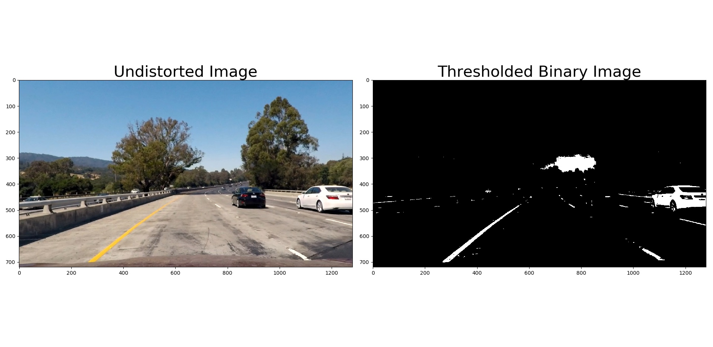

## Advanced Lane Finding

This repository contains the project I implemented as part of Udacity Self Driving Car Nano Degree Program.

The high level goal of this project is to implement an image pipeline to detect the lane boundaries from the given image or video.

### High level steps of this project are following,

* Compute camera calibration and distortion coefficients from the chessboard images.
* Apply distortion correction on the images/frames.
* Explore and find appropriate color transforms and gradient to create thresholded binary images
* Apply perspective transform to warp the image to create warped image.
* Identify the lane lines pixels and fit them to a second order polynomial.
* Compute the radius of the carvature of the lane and position of the vehicle from the center of lane.
* Perform inverse transform to plot the detected lanes back onto original road images. 
* Output visual display of the lane boundaries and numerical estimation of lane curvature and vehicle position.

## Rubric Points 

In this section I will describe how each of the Rubric points are implemented in my implementation.

### Camera Calibration 

A stand-alone python script "calibrate_camera.py" was implemented to compute the camera calibration and distortion coeficients of the camera based on the given chessboard images. This python script uses openCV funtions (findChessboardCorners() and calibrateCamera()) to compute the camera calibartion as described in the class. OpenCV function undistort() can then be used to remove the camera distortion. This script also writes the calibration/coeficients to a file using pickle ("calibration.p"), so that this can be utilized in the image pipeline implementation.

Image below shows the result of distortion correction using camera calibration and distortion coeficients on a eample chess board image.


### Image Pipeline

#### 1. Provide an example of a distortion-corrected image.

Following is an example of distortion corrected road image.


#### 2. Describe how (and identify where in your code) you used color transforms, gradients or other methods to create a thresholded binary image. Provide an example of a binary image result.

I have tried different color transform such as HLS (Hue Lightness Saturation), LAB and gradient (Absolute Sobel, Magnitude Sobel, Direction Sobel) methods. These functions are implemented in image_thresholds.py python module. I have also implemented another python script ("explore_image_thresholds.py") to apply these various methods on a set of road images provided under the "test_images" directory. Result of applying these different methods are shown below.


It turns out that LAB-B channel is pretty good in finding the yellow lines on the road and HLS-L channel is good in detecting white lines. I found that the the Gradients methods are either detecting too many unwanted pixles or not detecting the lines especialely under tricky lighting conditions. Hence I decided to use combination of LAB-B and HLS-L to implement thresholded binary images.

Here is an example of binary thresholded image generated by the pipeline.



#### 3. Describe how (and identify where in your code) you performed a perspective transform and provide an example of a transformed image.

This is implemented in `warp()` function in image_thresholds.py. This function internally uses OpenCV functions `getPerspectiveTransform()` and `warpPerspective()`. `warp()` function accepts src and dst points. I have hardcoded the src and dst points. src points were chosen by manually drawing a lane boundary on a test image and dst points were chosen such that the perspective transformed lanes lines would look parallel.

src points were chosen based on the below lane bounday rectangle.


Following is the src and dst points I came up with.

```python
    src = np.float32([(630,450),
                      (720,450), 
                      (220,714), 
                      (1130,714)])
                      
    dst = np.float32([(450,0),
                      (830,0),
                      (450,720),
                      (830,720)])
```

Following is an example of perpective transformation applied on a test image.


#### 4. Describe how (and identify where in your code) you identified lane-line pixels and fit their positions with a polynomial?

There are two functions implemented to identify the lane lines. `sliding_window_lane_search()` and `search_around_poly()`. 

`sliding_window_lane_search()` uses histogram with sliding window algortithm as explained in the class material. This function computes histogram of the lower half of the image to identify the left and right base "X" points. Original implementaton in the quiz was looking for a peak in left and right half of the histogram. One change I made was to narrow the region that looks for histogram peak. This implementation identifies left line from quarter-point to mid-point of the histogram. Similarly, it looks for right line from mid-point to three quarter point. This has helped to avoid the adjacent lane lines being detected. Once the left and right base points are identified, sliding window algorithm is used to track the lines from bottom ("base") to all the way to top of the image. Pixels that belong to each lines are identified and using NumPy's `polyfit()` function a second order polynomial is fitted.

Here is an example of sliding window on a test image.


`search_around_poly()` function also identifies the lane line polynomial from a previously detected polynomial. This function is more efficient than the `sliding_window_lane_search()` since it only searchs +/-100 pixels around previously found polynomial. 

Following image shows the lane line search area in "Green". Red and Blue dots shows the pixels identified for left and right lines respectively and Yellow line shows the polynomial fit using the pixels detected in the current frame.


#### 5. Describe how (and identify where in your code) you calculated the radius of curvature of the lane and the position of the vehicle with respect to center.

Radius of curvature was computed based on the equations presented in "Measureing Curvature" section of "Advanced Computer Vision" lesson. This is explained in detail [here](https://www.intmath.com/applications-differentiation/8-radius-curvature.php). This is implemented in `measure_curvature_real()`.

I have converted the distance from pixels to meters using following equation.
```python
    ym_per_pix = 30/720 # meters per pixel in y dimension
    xm_per_pix = 3.7/700 # meters per pixel in x dimension
```

The radius of curvature is computed on left and right lines separately on each frame and the average of left and right radius is used for reporting.

Position of the vehicle from the center of the lane was calculated using following lines of code.

```python
center_of_lane = (right_fitx[h-1] + left_fitx[h-1])/2
center_offset_meters = abs(w/2 - center_of_lane) * (3.7/700)
```
The above code finds the x-intercept of left and right lines, it then finds the center of the lane. Assuming that the camera is mounted on the center of the vehicle, vehicle position is the difference between lane center point and image mid-point. As you can see from the implementation above, a factor of `3.7/700` is applied to convert the position to "meters" from pixel space.

#### 6. Provide an example image of your result plotted back down onto the road such that the lane area is identified clearly.

This is implemented in function `draw_lane_lines()`. This function first creates a blank image and then, draws the left and right polinomial curves. It then fills the area between the curves in Green color. Inverse perspective transform is then applied on this image and then overlayed on to the undistorted raod image.

Final output image generated by `image_pipeline()` function is annotated with radius of curvature and vehicle position. This is implemented using OpenCV `cv2.putText()`.

Following is an example image generated by the `image_pipeline()` function.


### Pipeline (Video)

Provide a link to your final video output. Your pipeline should perform reasonably well on the entire project video (wobbly lines are ok but no catastrophic failures that would cause the car to drive off the road!)

Link to my project video output is [here](./project_video_output.mp4)

Link to challenge video output is [here](./challenge_video_output.mp4)

### Briefly discuss any problems / issues you faced in your implementation of this project. Where will your pipeline likely fail? What could you do to make it more robust?


